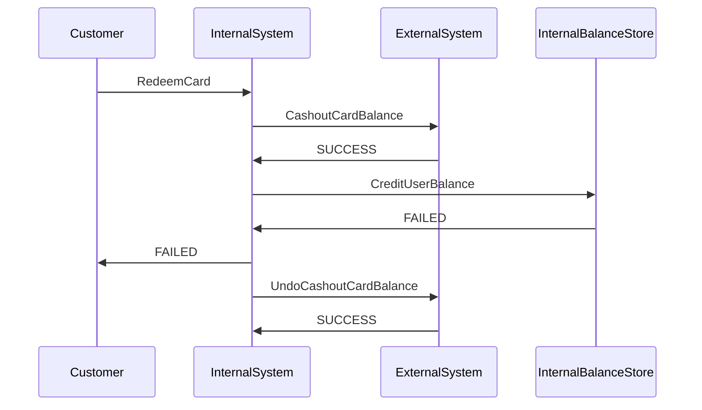

# CardTransfer

In this exercise, we model a financial system that moves a balance from an external financial institution to an internal institution.

Pseudocode:

```
Customer requests balance transfer, provides card number and PIN
InternalSystem marks transaction start
InternalSystem creates a CashOut action on ExternalSystem
If response is CASHOUT_FAILURE:
  Internal system fails the transaction
(Else response is SUCCESS:)

InternalSystem attempts to CreditInternalBalance
If Operation FAILS:
  InternalSystem queues a reversal action
  InternalSystem marks transaction failed
(Else operation SUCCESS:)
InteranlSystem marks transaction success, and
  User is credited extra card amount
```

Flowchart:


