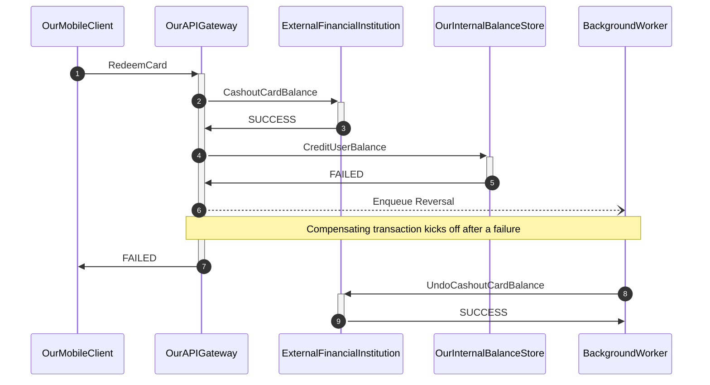

# BankTransfer

This is a simplified distributed system coordination problem.

In this exercise, imagine we are a bank, and we are serving an API request from our banking mobile app to initiate a bank transfer from an external financial institution to the user's account.

 We are building a API endpoint that asks the other financial institution to move money over to us.
 
 The wrinkle here is that internally, the transfer also needs to be synchronized with a third, internal transaction database (our internal source of truth) to formally recognize the balance in the user's account.

 How do we design this system to ensure the design is resilient to failures and outages?
 

### Requirements:

- We must guarantee that balances are kept consistent between our system and the external institutions. No money should be lost/created on either side (obviously).
- The external service may fail to process the transaction for any reason (downtime, network partition, system error)
- The internal transaction service may also fail to process the transaction for any reason (antifraud rules, domain logic, ratelimiting, network partitions)

Our current design works like this: 


```
Customer requests balance transfer, provides card number and PIN
InternalSystem marks transaction start
InternalSystem creates a CashOut action on ExternalSystem
If response is CASHOUT_FAILURE:
  Internal system fails the transaction

[Else response is SUCCESS:]

InternalSystem attempts to CreditInternalBalance
If Operation FAILS:
  InternalSystem marks transaction failed
  API reponse to customer is FAILURE
  InternalSystem queues a reversal action
Else operation SUCCESS:
  InternalSystem marks transaction success, and
  User is credited extra card amount
  API response to customer is SUCCESS
```

Flowchart:



This is 