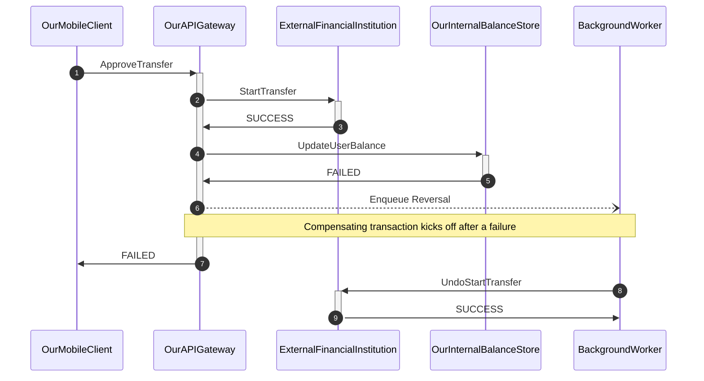

# BankTransfer

This is a simplified distributed system coordination problem.

In this exercise, imagine we are a bank, and we are serving an API request from our banking mobile app to initiate a bank transfer from an external financial institution to the user's account.

 We are building a API endpoint that asks the other financial institution to move money over to us.
 
 The wrinkle here is that internally, the transfer also needs to be synchronized with a third, internal transaction database (our internal source of truth) to formally recognize the balance in the user's account.

 How do we design this system to ensure the design is resilient to failures and outages?
 

### Requirements:

- We must guarantee that balances are kept consistent between our system and the external institutions. No money should be lost/created on either side (obviously).
- The external service may fail to process the transaction for any reason (downtime, network partition, system error)
- The internal transaction service may also fail to process the transaction for any reason (antifraud rules, domain logic, ratelimiting, network partitions)
- The API request is synchronous, and must respond within 200ms @ p99

### The Happy Path

We illustrate the system design using the happy path. Our mobile client calls an API gateway, which we use as a transaction coordinator.

The API gateway makes 2 calls. First, it calls the external financial institution to initiate the transfer. If the transfer is successful, the API then turns around and pings the internal balance store service to note the transaction was a success.

(Note that this is not representative of a real world bank! This is a contrived, simplified example).

Because we need our API to be synchronous, the API coordinator blocks until both responses are success, before returning a success response to the client.


### Internal API error with compensating transaction

Of course, we know that errors can crop up in the real world. If the call to either service borks, we will need a way to either retry or fail gracefully. Here, we consider the use case where our internal API service crashes.

We consult with the team and decide that if the API service crashes for any reason, we will want to undo the transaction in the external financial institution with a compensating transaction. We will throw this work onto an external queue as soon as an error occurs.



This should work, right?

## Enter formal specifications!

OK, let's try to model this behavior as a formal TLA+ spec. I'll write out how the spec would look, and we'll go through it line by line:

```tla
EXTENDS TLC, Integers, Sequences
(*--algorithm transfer_bank_balance

variables
    queue = <<>>,
    reversal_in_progress = FALSE,
    transfer_amount = 5,
    button_mash_attempts = 0,
    external_balance = 10,
    internal_balance = 0;

define
    NeverOverdraft == external_balance >= 0
    EventuallyConsistentTransfer == <>[](external_balance + internal_balance = 10)
end define;

\* This models the API endpoint coordinator
fair process BankTransferAction = "BankTransferAction"
begin
    ExternalTransfer:
        external_balance := external_balance - transfer_amount;
    InternalTransfer:
        either
          internal_balance := internal_balance + transfer_amount;
        or
          \* Internal system error!
          \* Enqueue the compensating reversal transaction.
          queue := Append(queue, transfer_amount);
          reversal_in_progress := TRUE;

          \* The user is impatient! Their transfer must go through. They button mash (up to 3 times)..
          UserButtonMash: 
\*            await reversal_in_progress = FALSE;         
            if (button_mash_attempts < 3) then
                button_mash_attempts := button_mash_attempts + 1;

                \* Start from the top and do the external transfer
                goto ExternalTransfer;
            end if;
        end either;
end process;

\* This models an async task runner that will run a
\* a reversal compensating transaction. It uses
\* a queue to process work.
fair process ReversalWorker = "ReversalWorker"
variable balance_to_restore = 0;
begin
    DoReversal:
      while TRUE do
         await queue /= <<>>;
         balance_to_restore := Head(queue);
         queue := Tail(queue);
         external_balance := external_balance + balance_to_restore;
         reversal_in_progress := FALSE;
      end while;

end process;
 
end algorithm;*)
```

Whew, ok! That's a lot. Let's go through it line by line:

```tla
EXTENDS TLC, Integers, Sequences
(*--algorithm transfer_bank_balance
```

These are program headers. These define the modules we should import into the global namespace of our model.

The `(*--algorithm ...` preamble marks the beginning of the PlusCal script (bookended by `end algorithm;*)` at the end of the program.

Next up, we declare variables and operators:

```tla
\* These are global variables
variables
    queue = <<>>,
    reversal_in_progress = FALSE,
    transfer_amount = 5,
    button_mash_attempts = 0,
    external_balance = 10,
    internal_balance = 0;

define
    NeverOverdraft == external_balance >= 0
    EventuallyConsistentTransfer == <>[](external_balance + internal_balance = 10)
end define;
```